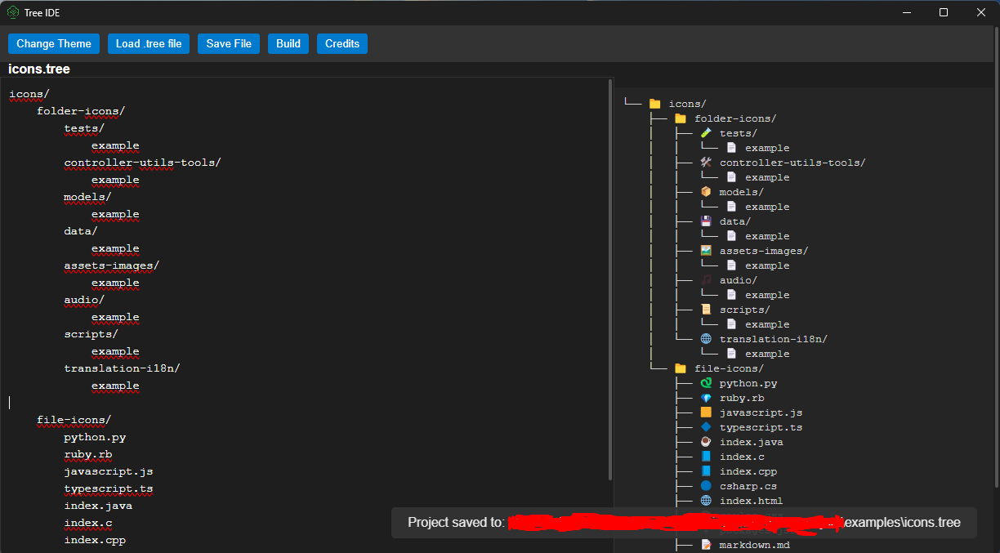

# Tree IDE

**Tree IDE** is a lightweight, open-source project structure editor designed for developers who want to quickly design, visualize, and build directory trees from a simple text-based editor.  
It combines a plain-text editor with a real-time tree view and one-click project generation.
(Temporary) Website: [https://tree.immare.xyz/](https://tree.immare.xyz/)
---

## Features

- **Text-based structure editor**: Write your folder and file structure in plain text.
- **Real-time tree view**: See your structure rendered as a tree while you type.
- **File & folder icons**: Popular file extensions and folder names are automatically displayed with icons.
- **Indentation control**: Use <kbd>Tab</kbd> and <kbd>Shift</kbd>+<kbd>Tab</kbd> to increase/decrease indentation.
- **Keyboard shortcuts**:
  - <kbd>Ctrl</kbd> + <kbd>S</kbd> → Save
  - <kbd>Ctrl</kbd> + <kbd>Shift</kbd> + <kbd>S</kbd> → Save As
- **Theme switcher**: Toggle between light and dark theme.
- **Toast notifications**: Feedback for save and build actions.
- **Build mode**: Automatically create the directory structure on your machine.
- **Credits modal**: Built-in credits screen with project information and license.

---

## Installation

1. Clone the repository:
   ```bash
   git clone https://github.com/git-mare/TreeIDE.git
   cd TreeIDE
   ```

2. Install dependencies:
    ```
    npm install
    ```

3. Run in development mode:
    ```
    npm start
    ```

## Usage
1. Launch Tree IDE.
2. Use the text editor on the left to write your structure.
    Example:
    ```
    src/
        index.js
        styles.css
    assets/
        images/
        audio/
    README.md
    ```
3. The tree view on the right updates automatically.

4. Click Build to generate the folders and files.

5. Save and load .tree project files with the toolbar.

- Note: You can check [`/examples`](/examples) folder and load the tree files on the IDE. 

## Keyboard Shortcuts
- <kbd>Tab</kbd> → Indent line / Increase nesting level.

- <kbd>Shift</kbd> + <kbd>Tab</kbd> → Unindent line / Decrease nesting level.

- <kbd>Ctrl</kbd> + <kbd>S</kbd> → Save current file.

- <kbd>Ctrl</kbd> + <kbd>Shift</kbd> + <kbd>S</kbd> → Save As.

## Project Structure
```
tree-ide/
│── assets/           # App icon
│── examples/         # .tree Example Files 
│── main.js           # Electron main process
│── preload.js        # Exposes safe APIs to renderer
│── renderer.js       # UI logic and tree rendering
│── index.html        # Main window UI
│── styles.css        # Theme and layout
│── package.json      # Project metadata & scripts
│── README.md         # Documentation
└── LICENSE           # MIT License
```

## Credits
- Project Creator: git-mare (me)

## License
- This project is licensed under the MIT License.
- You are free to use, modify, and distribute this software, provided that proper credit is given to the original author.

## Screenshot
